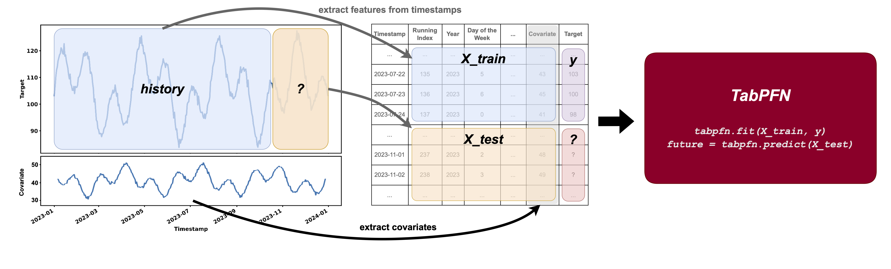

# TabPFN-TS

> Zero-Shot Time Series Forecasting with TabPFN

[](https://badge.fury.io/py/tabpfn-time-series)
[](https://colab.research.google.com/github/PriorLabs/tabpfn-time-series/blob/main/examples/quickstart.ipynb)
[](https://discord.com/channels/1285598202732482621/)
[](https://arxiv.org/abs/2501.02945v3)

## 📌 News
- **12-05-2026**: 🚀 **v1.1.0** — defaults now ship the **TabPFN-TS-3** finetuned checkpoint from the [TabPFN-3 report](https://priorlabs.ai/reports/tabpfn-3) for SOTA forecasting out of the box. Requires `tabpfn>=8.0.0`.
- **27-05-2025**: 📝 New **[paper](https://arxiv.org/abs/2501.02945v3)** version and **v1.0.0** release! Strong [GIFT-EVAL](https://huggingface.co/spaces/Salesforce/GIFT-Eval) results, new AutoSeasonalFeatures, improved CalendarFeatures.
- **27-01-2025**: 🚀 Ranked _**1st**_ on [GIFT-EVAL](https://huggingface.co/spaces/Salesforce/GIFT-Eval) benchmark<sup>[1]</sup>!
- **10-10-2024**: 🚀 TabPFN-TS [paper](https://arxiv.org/abs/2501.02945v2) accepted to NeurIPS 2024 [TRL](https://table-representation-learning.github.io/NeurIPS2024/) and [TSALM](https://neurips-time-series-workshop.github.io/) workshops!

_[1] Last checked on: 10/03/2025_

## ✨ Introduction
We demonstrate that the tabular foundation model **[TabPFN](https://github.com/PriorLabs/TabPFN)**, combined with lightweight feature engineering, enables zero-shot time series forecasting for both point and probabilistic tasks. On the **[GIFT-EVAL](https://huggingface.co/spaces/Salesforce/GIFT-Eval)** benchmark, our method achieves performance on par with top-tier models across both evaluation metrics.

As of **v1.1.0** the package ships with the finetuned **TabPFN-TS-3** checkpoint by default — a tabular foundation model that, despite being pretrained purely on synthetic data, achieves SOTA results on [fev-bench](https://github.com/autogluon/fev). See the [TabPFN-3 report](https://priorlabs.ai/reports/tabpfn-3) for benchmarks.

## 📖 How does it work?

Our work proposes to frame **univariate time series forecasting** as a **tabular regression problem**.



Concretely, we:
1. Transform a time series into a table
2. Extract features and add them to the table
3. Perform regression on the table using TabPFN
4. Use regression results as time series forecasting outputs

For more details, see our [paper](https://arxiv.org/abs/2501.02945v3) and the [TabPFN-3 report](https://priorlabs.ai/reports/tabpfn-3).
<!-- and our [poster](docs/tabpfn-ts-neurips-poster.pdf) (presented at NeurIPS 2024 TRL and TSALM workshops). -->

## 🧮 Covariate model — what's used vs. what's not

TabPFN-TS treats forecasting as **univariate, target-history + known-future
covariate** regression. Concretely:

| Input column type | Used? | Notes |
|---|---|---|
| Target (univariate or multivariate) | ✅ | Multivariate targets are decomposed into N independent univariate forecasts. |
| Known dynamic covariates (e.g. holidays) | ✅ | Future values must be supplied in `future_df`. |
| **Past dynamic** covariates (e.g. weather observations) | ❌ | Dropped — no future values available. |
| **Static** covariates (e.g. item_id, store_size) | ❌ | Currently dropped. |
| Engineered temporal features (calendar, sin/cos, …) | ✅ | Auto-generated by `TABPFN_TS_DEFAULT_FEATURES`. |

If your task relies on `past_dynamic` or `static_columns`, performance may be lower than dedicated multivariate / static-aware forecasters.

## 👉 **Why give us a try?**
- **Zero-shot forecasting**: this method is extremely fast and requires no training, making it highly accessible for experimenting with your own problems.
- **Point and probabilistic forecasting**: it provides accurate point forecasts as well as probabilistic forecasts.
- **Known-future covariate support**: pass covariates whose future values are known at forecast time (calendar, holidays, scheduled events, demand or weather forecasts) directly alongside the target — see [Covariate model](#-covariate-model--whats-used-vs-whats-not) for details on what's supported.

On top of that, thanks to **[tabpfn-client](https://github.com/automl/tabpfn-client)** from **[Prior Labs](https://priorlabs.ai)**, you won't even need your own GPU to run fast inference with TabPFN. 😉 We have included `tabpfn-client` as the default engine in our implementation.

## ⚙️ Installation

You can install the package via pip:

```bash
pip install tabpfn-time-series
```

### Checkpoint

`v1.1.0+` ships the **TabPFN-TS-3** finetuned checkpoint by default. In `LOCAL` mode `tabpfn` downloads it automatically on first init — accept the license at [ux.priorlabs.ai](https://ux.priorlabs.ai) first.

### For Developers

To install the package in editable mode with all development dependencies, run the following command in your terminal:

```bash
pip install -e ".[dev]"
# or with uv
uv pip install -e ".[dev]"
```

## 🚀 Getting Started

```python
from tabpfn_time_series import TabPFNTSPipeline

pipeline = TabPFNTSPipeline()  # uses the cloud client by default — no GPU needed
predictions = pipeline.predict_df(context_df, prediction_length=24)
```

For full walkthroughs:

| I want to... | Notebook |
|--------------|----------|
| Use it on my project | [**quickstart.ipynb**](examples/quickstart.ipynb) |
| Understand how it works | [**how-it-works.ipynb**](examples/how-it-works.ipynb) |

More examples live in the [examples/](examples/) directory.

## 📚 Citation

If TabPFN-TS is useful in your research, please cite the [paper](https://arxiv.org/abs/2501.02945v3) (`arXiv:2501.02945`) and the [TabPFN-3 report](https://priorlabs.ai/reports/tabpfn-3) for the v3 checkpoint.

## 📊 Anonymous Telemetry

This project collects **anonymous usage telemetry** by default.

The data is used exclusively to help us understand how the library is being used and to guide future improvements.

- **No personal data is collected**
- **No code, model inputs, or outputs are ever sent**
- **Data is strictly anonymous and cannot be linked to individuals**

### What we collect
We only collect high-level, non-identifying information such as:
- Package version
- Python version
- How often fit and inference are called, including simple metadata like the dimensionality of the input and the type of task (e.g., classification vs. regression) (:warning: never the data itself)

See the [Telemetry documentation](https://github.com/priorlabs/tabpfn/blob/main/TELEMETRY.md) for the full details of events and metadata.

This data is processed in compliance with the **General Data Protection Regulation (GDPR)** principles of data minimization and purpose limitation.

For more details, please see our [Privacy Policy](https://priorlabs.ai/privacy_policy/).

### How to opt out
If you prefer not to send telemetry, you can disable it by setting the following environment variable:

```bash
export TABPFN_DISABLE_TELEMETRY=1
```
---
