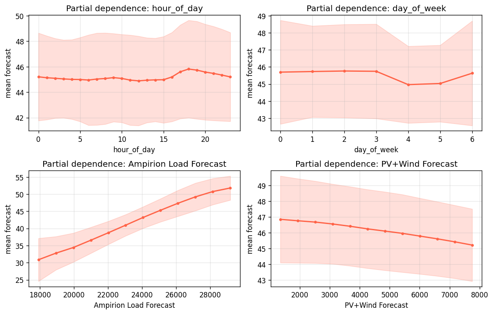
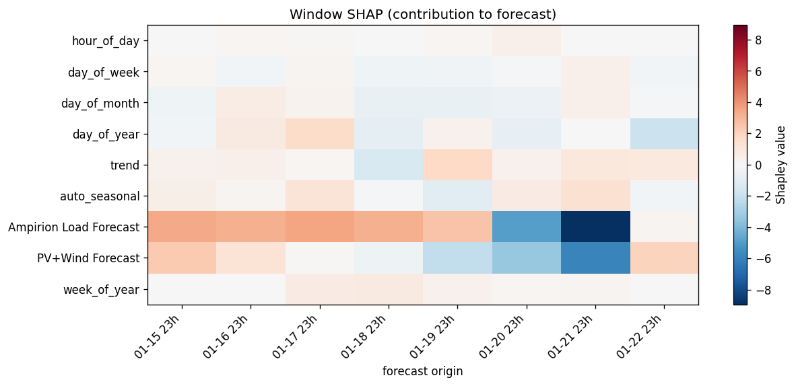
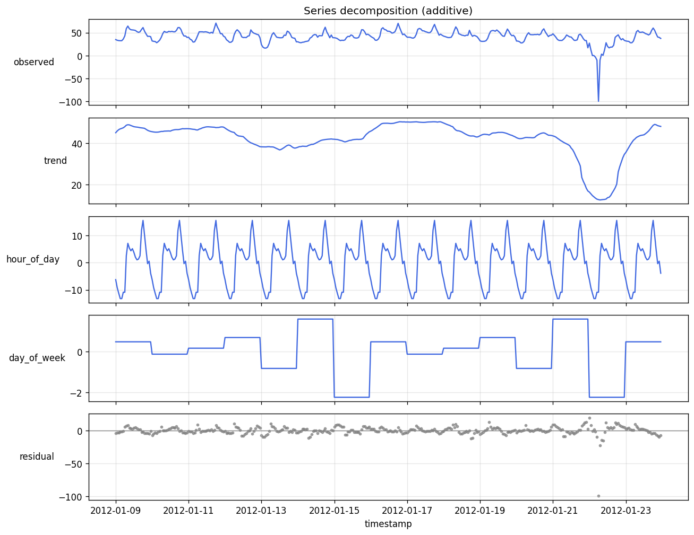

# TabPFN Time Series Examples

This folder contains usage examples demonstrating core functionalities of the `tabpfn-time-series` library.

## Examples

- `tabpfn_family_model_as_backbone.py`: showcases how to use any TabPFN-family model as the inference backbone.
- `sklearn_model_as_backbone.py`: showcases how to use any standard Sklearn regressors as the inference backbone.
- `explainability_electricity.py`: explains a forecast with `TabPFNTSExplainer` (partial dependence, window SHAP, forecast decomposition) on the electricity-price dataset. Saves figures to `explainability_outputs/`.

### Explainability (`explainability_electricity.py`)

`TabPFNTSExplainer` wraps a fitted `TabPFNTSPipeline` and offers three lightweight explanations. All of them keep cost down by fitting the model once per window and reusing that fit across every perturbation (only the forecast horizon changes), so the number of TabPFN fits equals the number of windows, not the number of perturbations.

**Partial dependence** over calendar concepts (in the original feature space, e.g. sweep hour 0..23 and re-encode to sin/cos) and over known covariates:

**Window SHAP**: grouped Shapley attributions across rolling windows, a feature × time "spectrogram":

**Series decomposition**: a classic model-free additive decomposition of the autoregressive signal into trend + per-time-feature seasonal components + residual (`observed = trend + hour_of_day + day_of_week + residual`):

